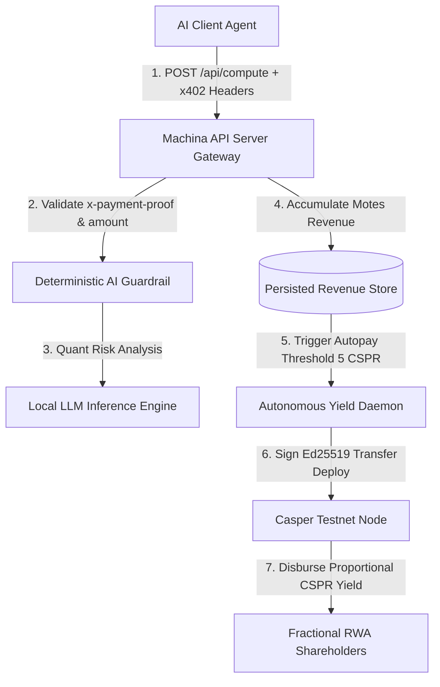

# Machine RWA: Autonomous Hardware Franchise on Casper Network

Machine RWA is an autonomous physical hardware-leasing platform built for the **Casper Agentic Buildathon 2026 (Final Round)**. It tokenizes physical machine compute (e.g. local GPU inference nodes, IoT sensors, or render farms) into self-owned, revenue-generating franchises on the Casper Network.

It directly implements the **Casper AI Toolkit**, specifically utilizing **x402 HTTP Micropayments**, **CSPR.click Agent Skills**, **Casper Testnet smart contracts**, and **Model Context Protocol (MCP)** principles.

---

## 🎯 Architectural Overview



---

## 🚀 Key Features

1. **x402 Micropayments Protocol Gateway**
   - HTTP-native payment gating requiring `x-payment-proof` (Casper Deploy Hash) and `x-payment-amount` (motes).
   - Replay attack prevention with bounded memory proof sets and float/BigInt protection.

2. **Dynamic Thinking Orbs Visualizer UI**
   - Canvas-based particle animation inspired by `thinking-orbs` reflecting live AI cognitive states (`IDLE`, `THINKING`, `COMPLETED`, `HALTED`).
   - Hardware Listing & Resource Management Modal allowing operators to dynamically adjust compute pricing, node titles, and shareholder splits.

3. **Deterministic Quantitative Agent Guardrail**
   - Evaluates incoming payloads for real quantitative RWA metrics.
   - Self-scores confidence levels and automatically **HALTS** execution if confidence drops below safety thresholds (< 85%).

4. **Autonomous Yield Distribution Daemon**
   - Background daemon signs native CSPR transfers on Casper Testnet using local Ed25519 keys once accumulated x402 revenue crosses 5 CSPR.

---

## 🛠 User Flow & Hardware Resource Listing

### 1. Resource Provider / Machine Operator Flow
- Launch the Machina node using PM2 or Node.js.
- Click **"List / Edit Hardware Resource"** in the UI to set your node title, minimum fee per request (in motes), and shareholder revenue split (e.g. 60% Operator / 40% Backers).
- Monitor live CPU temperature, inference counts, and accumulated CSPR yield.

### 2. Client Agent / Buyer Flow
- Query `/status` to get the machine's public key identity and minimum pricing fee.
- Send CSPR on Casper Testnet and obtain the Deploy Hash.
- Submit a request to `/api/compute` passing the deploy hash in `x-payment-proof`.
- Receive structured, quantitative RWA risk analysis outputs.

---

## ⚙️ Quickstart & Local Setup

```bash
# 1. Install dependencies
npm install

# 2. Start the Machine Server and Yield Daemon via PM2
pm2 start ecosystem.config.js

# Or run directly via Node:
node src/server.js
```

Access the Live Telemetry & Resource Listing Dashboard at `http://localhost:8090`.

---

## 🏆 Casper Buildathon Track Alignment

- **DeFi & RWA**: Tokenizes hardware yield via automated Testnet CSPR transfers to fractional holders.
- **Agentic AI**: Features autonomous background daemons, deterministic JSON-schema guardrails, and AI agent cognitive feedback.
- **Developer Toolkit**: Showcases native HTTP x402 payment headers for machine-to-machine commerce.
